# Lecture 22: Quantum Machine Learning (Part I)

## Note Information

| Title       | Quantum Machine Learning (Part I)                                               |
| ----------- | ------------------------------------------------------------------------------------------------------ |
| Lecturer    | Song Han                                                                                               |
| Date        | 11/29/2022                                                                                             |
| Note Author | Mark Jabbour (mjabbour)                                                                                         |
| Description | This lectures introduces the current state of quantum machine learning 

## Lecture overview
1. NISQ devices
2. Parametrized Quantum Circuit (PQC)
3. PQC training
4. Quantum classifiers
5. Noise aware on chip training (QOC) of PQC
6. TorchQuantum library for QML

### 1. Noisy Intermediate-Scale Quantum devices 

Quantum computers are currently in what's known as the noisy interemediate-scale (NISQ) ERA. They are charecterised by the following limitations:

1. **Noisy:** Current Qubit gates have a very high error rate, on the order of $10^{-3}$.  This makes quantum computing somewhat unreliable, and makes training models challenging
1. **Limited Number of Qubits:** Modern Quantum computers have Qubits on the order of hundreds. While some of the most interesting applications like factorization require millions of Qubits
 
1. **Limited Connectivity:**  Having less connections between Qubits dictates having to add swap operation whenever we wish to perform an operation on none-neighboring Qubits. This complicates the issue of deceiding which logical Qubits are stored in which physical Qubits, also known as Qubit mapping. See an example below:

 
 

### 2. Parametrized Quantum Circuit (PQC)

#### QML approaches

* **CC**: Classical Data, Classical algorithm: The machine learning we know and love

* **CQ**: Classical Data, Quantum algorithm: The main focus here, using quantum computing to make inference on classical data

* **QC**: Quantum Data, Classical algorithm: Mostly used to aid in quantum computers. Solves problems like: qubit control, calibration, readout...

* **QQ**: Quantum Data, Quantum algorithm: process quantum info with quantum machine

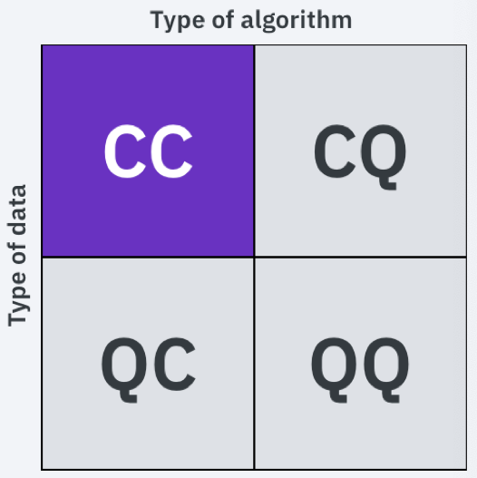 

#### Definition of a Parametrized Quantum Circuit

Quantum algorithms can be described as quantum circuits. In which some gates are fixed like the Hadamard or swap gates, and others have tunable parameters like rotations. Below is an example:

 

#### Expressivity of a Quantum circuit

Similar to how we study the power of a traditional model by it's ability to approximate other functions. One way to study the power of a quantum model is by it's expressivity; how much of the Hilbert space it covers. More specifically we measure the KL divergence of the output of 1 when given to a random model from a uniformly random point on the Hilbert space. See some examples below:

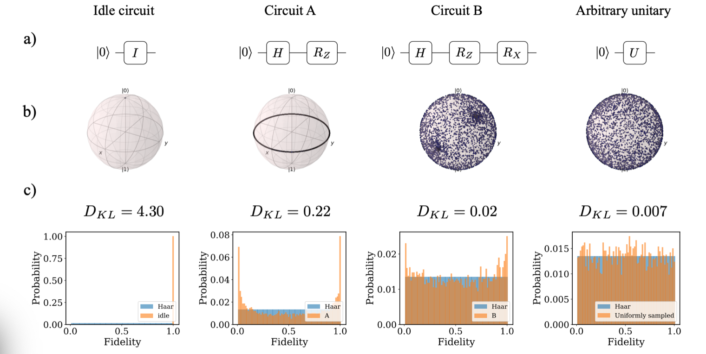 

#### Entanglement capability of a Quantum circuit

An altertnative measurement for the power of a quantum model is it's entanglment capacity. The Meyer-wallach measure tells how entangled a given state is with a number in [0, 1], with unentangled state being 0, and entangled state being 1. We use the average   Meyer-wallach (**averaged MW**)  to measure the entanglement capability of circuit.

For instance below is a selection of circuit, and their average Meyer-wallach measures with different accross a different number of layers L. As we can see increasing the numebr of layers increases entanglment.

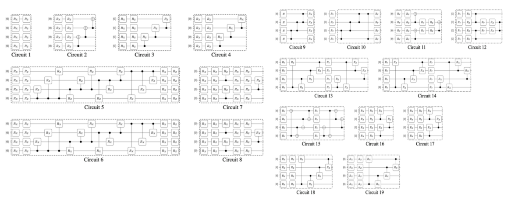 

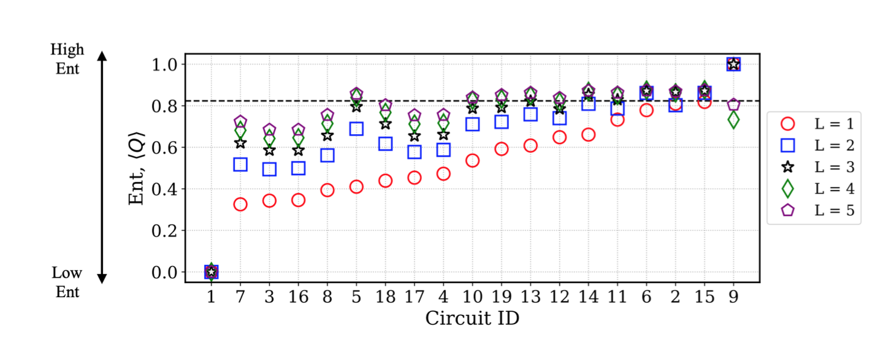 

#### Hardware Effeciency consideration

Optimizing quantum circuits is a tricky problem. one thing that we try to do is minimie the number of swap gates. Another thing that matters is whether the gates we are applying are native to the machine we are deploying on or not.

#### Encoding

There are four kinds of popular encoding of numbers in quantum machines:

* **Basis Encoding**: Same the encoding used in classical data, where to represent an integer of size at most $2^n$ we require $n$ bits. For instance if $x = 2$ is reprented as $10$ on a classical machine we represent as $|10>$. This is clearly ineffecient as it does use the advantages of quantum computers.

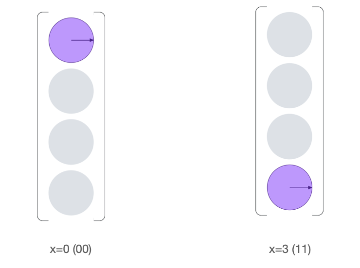 

* **Amplitude Encoding**: 

The numbers are encoded as the statevector of the qubits. That way For N features, need logN qubits

 

It is also possible to encoder multiple data points together using circuits as below. However, a disadvantage of this is that the circuits tend to be a little too much for NISQ era machines.

 

* **Angle Encoding**:

We can encode the data in the rotation angles of the qubit gates. The main advantage of this is that the circuits are simpler. This is th one we most commonly use. For instance for the vector $\[0, \frac{\pi}{4}, \frac{\pi}{2} \]$ we get the following circuit

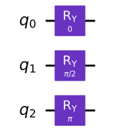 

* **Arbitrary Encoding**: 

Design **arbitrary** parameterized quantum circuit and let input data as the rotation angles

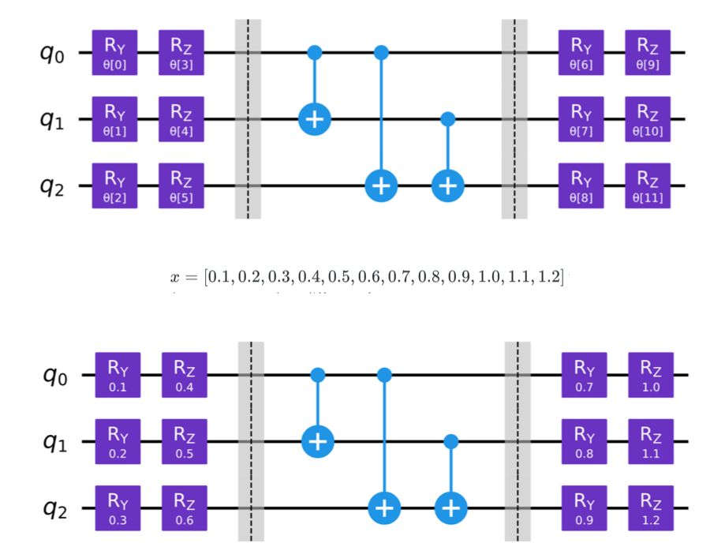 

### 3. PQC training

Similar to neural nets, we can try to train PQCs and optimize their parameters to perform data driven tasks.

#### Gradients

Our favorite optimization algorithm, gradient descent, requires that we compute gradients. We exploe a few ways to do that below:

* **Finite Difference Gradient**: We can always resort to what we usually do on classical computers

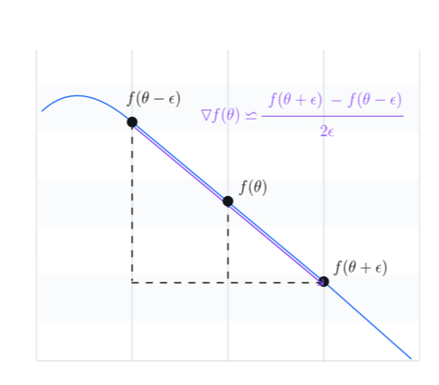 

However, this suffers from accuracy issues as in classical machines. It also does not use the advantages of quantum computers.

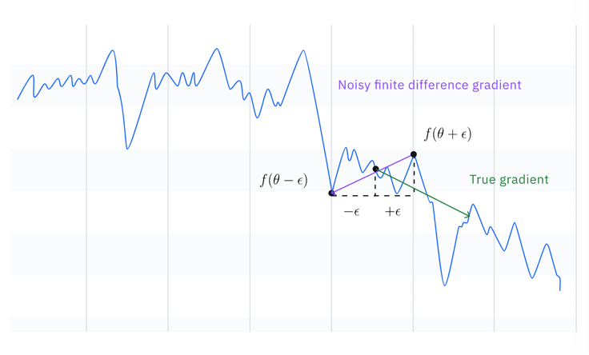 

* **Parameter-Shift Gradients**: It turns out that we do not need to approximate gradients! If we look closely at a function of the output of a parametrized gate $f$ (the gate is parametrized by $\theta$), we see that $\frac{\partial }{\partial \theta}f(\theta) = \frac{1}{2}(f(\theta + \frac{\pi}{2}) - f(\theta - \frac{\pi}{2}))$. Since most of our gates are rotational, this is allows us to compute explicit gradients for most gates. The proof is beyond the scope of this lecture, but we invite the interested reader to look at [[Crooks, 2019]](https://arxiv.org/abs/1905.13311) to learn more. The process is illustrated in the diagram below:

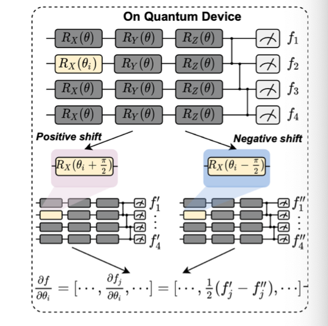 

* **Back propagation**: Finally, we can also use backpropagation. Though unfortunately this can not be done on actual machine as we can not measure a qubit without affecting it. This needs to take place on a simulator. The process follows the following steps:

**A Full system:**

We can combine the different approaches above to get gradients as follows:

1. Run on QC without shift to obtain f (on quantum device)
2. Use a classical device to get the loss Loss 
3. Back propagate on the classical deevice to get $\frac{\partial loss}{\partial f}$
4. use shift twice to compute $\frac{\partial f(\theta_i)}{\partial \theta_i}$ on quantum device (or use finite difference approximation)
5. Apply the chain rule to get $\frac{\partial Loss}{\partial \theta_i}$ from the above

This is summarized in the following diagram:

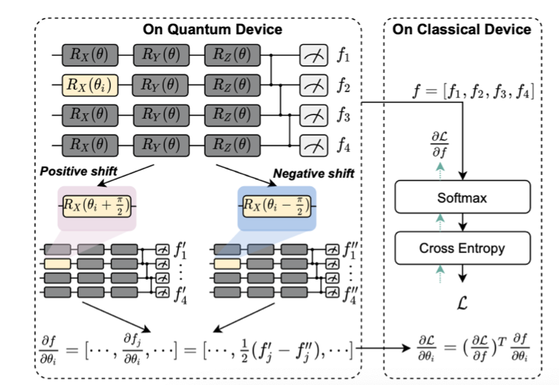 

#### Training techniques:

Now that we have our gradients we can explore how to use them to train! We can always use gradient descent. However, as you can see above, the derivative with respect to each parameter requires running the circuit two extra times. So for $N$ parameters we need to run it $2N + 1$ time per iteration. This can be prohibitively ineffecient. Therefore, we approximate the gradient from the two-phase shift, by shifting all the parameters simultaneously. Also known as **Simultaneous Perturbation Stochastic Approximation (SPSA)** as illustrated below:

 

We see in the diagram below that this has very similar performance to gradient descent:

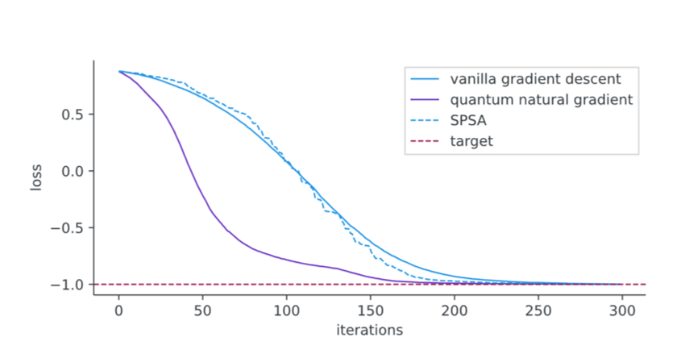